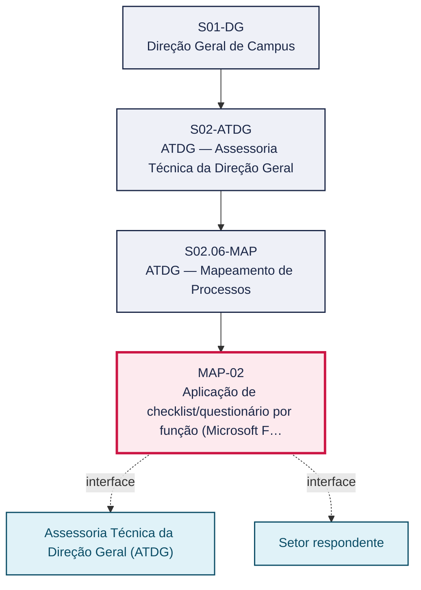
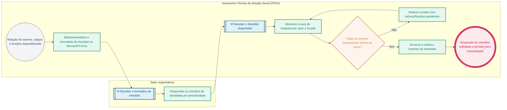

# POP MAP-02 — Aplicação de checklist/questionário por função (Microsoft Forms)

> **Documento vivo** · ATDG — Assessoria Técnica da Direção Geral · UNIOESTE Campus Foz do Iguaçu · Formato DDD híbrido + BPMN 2.0 padrão Anne Bail · Versão **1.0.0** · Status **em_validacao** · Atualizado em 2026-09-03

## 0. Cabeçalho DDD

| Divisão | Departamento | Descrição |
|---|---|---|
| ATDG — Assessoria Técnica da Direção Geral | ATDG — Mapeamento de Processos | Aplicação de checklist/questionário por função (Microsoft Forms). Processo codificado no manual institucional da ATDG (jun/2026); conteúdo operacional a documentar. |

| Domínio | Subdomínio | Tipo | Contexto delimitado |
|---|---|---|---|
| Assessoria Técnica e Gestão por Processos | Aplicação de checklist/questionário por função (Microsoft Forms) | core | S02.06-MAP |

### 0.3 Linguagem ubíqua (glossário do processo)

| Termo | Definição | Sistema |
|---|---|---|
| Microsoft Forms | Ferramenta institucional utilizada para aplicação do checklist/questionário de levantamento de atividades por função. | Microsoft Forms |

## 1. Identificação

| Campo | Valor |
|---|---|
| Código | MAP-02 |
| Setor | ATDG — Assessoria Técnica da Direção Geral (`S02.06-MAP`) |
| Responsável (função) | Assessoria Técnica da Direção Geral (ATDG) |
| Periodicidade | Por ciclo do projeto de Mapeamento de Processos |
| Subordinação | ATDG — Assessoria Técnica da Direção Geral |
| Normativa | Lei nº 13.709/2018 (Lei Geral de Proteção de Dados Pessoais — LGPD) |
| Produto ATDG | POP |
| Pasta OneDrive | 03_MAPEAMENTO DE PROCESSOS |
| Fontes (entradas do Canvas) | pb-atdg, 1780963200015, 1780963200016, 1780963200017 |
| Lacunas abertas | prazo, dados_pessoais_lgpd |
| Agente responsável | pop-map-02 |

## 2. Organograma

## 3. Playbook

### 3.1 Gatilho (evento de domínio)

**Relação de setores, cargos e funções disponibilizada (MAP-01) para aplicação do checklist** — origem: Assessoria Técnica da Direção Geral (ATDG)

### 3.2 Entrada

- Relação de setores, cargos e funções (MAP-01)
- Modelo de checklist/questionário por função

### 3.3 Passo a passo

| Nº | Ação | Responsável | Sistema | Artefato | Prazo | Evento |
|---|---|---|---|---|---|---|
| 1 | Elaborar/atualizar o formulário de checklist por função no Microsoft Forms | Assessoria Técnica da Direção Geral (ATDG) | Microsoft Forms | Formulário de checklist | A definir | Formulário elaborado |
| 2 | Enviar o formulário às funções do escopo, segmentado pelos contatos por função | Assessoria Técnica da Direção Geral (ATDG) | Microsoft Forms | Convite ao formulário | A definir | Formulário enviado |
| 3 | Responder ao checklist com as atividades exercidas, por periodicidade | Setor respondente | Microsoft Forms | Checklist de atividades | A definir | Checklist respondido |
| 4 | Monitorar a taxa de resposta por setor e função | Assessoria Técnica da Direção Geral (ATDG) | Microsoft Forms | Painel de respostas | A definir | Taxa de resposta monitorada |
| 5 | Reiterar contato com setores/funções sem resposta dentro do prazo | Assessoria Técnica da Direção Geral (ATDG) | e-mail institucional | Comunicado de reiteração | A definir | Reiteração enviada |
| 6 | Encerrar a coleta e exportar as respostas para consolidação (MAP-03) | Assessoria Técnica da Direção Geral (ATDG) | Microsoft Forms | Base de respostas exportada | A definir | Coleta encerrada |

### 3.4 Saída (entregáveis)

- Respostas do checklist por função coletadas via Microsoft Forms
- Lista de pendências de resposta por setor

## 4. Formulários e artefatos (agregados)

| Nome | Tipo | Sistema | Campos-chave | Preenchimento |
|---|---|---|---|---|
| Formulário de checklist por função | formulario | Microsoft Forms | setor, cargo, função, chefia imediata, atividade, periodicidade | Assessoria Técnica da Direção Geral (ATDG) |
| Painel de respostas do checklist | registro | Microsoft Forms | função, status de resposta, data de resposta | Assessoria Técnica da Direção Geral (ATDG) |

## 5. Decisões, exceções e pontos de atenção

| Decisão | Condição | Sim → | Não → |
|---|---|---|---|
| Todas as funções do escopo responderam ao checklist dentro do prazo? | Painel de respostas do Microsoft Forms monitorado pela ATDG | Encerrar a coleta e exportar as respostas para consolidação (MAP-03) | Reiterar contato com os setores/funções pendentes |

**Pontos de atenção**

- Respostas do checklist contêm dados pessoais de servidores (nome, e-mail, cargo) — tratar conforme a LGPD (Lei nº 13.709/2018)
- Controlar versionamento do formulário para evitar respostas em modelos desatualizados

## 6. Contingência

- Função sem resposta após reiteração: escalar à chefia imediata ou à Direção Geral
- Formulário indisponível ou com erro no Microsoft Forms: comunicar aos respondentes e reabrir a coleta
- Resposta incompleta ou inconsistente: retornar ao respondente para complementação antes da consolidação

## 7. Checklist

- ( ) Formulário de checklist elaborado/atualizado
- ( ) Formulário enviado a todas as funções do escopo
- ( ) Taxa de resposta monitorada por setor
- ( ) Pendências reiteradas dentro do prazo
- ( ) Base de respostas exportada para consolidação

## 8. KPI / Indicadores

| Indicador | Fórmula | Meta | Fonte |
|---|---|---|---|
| Taxa de resposta ao checklist por função | (Funções respondentes / total de funções convidadas) × 100 | A definir | Microsoft Forms |
| Tempo médio de resposta ao checklist | Média (data de resposta − data de envio do formulário) | A definir | Microsoft Forms |

## 9. Mapa de contexto (interfaces inter-setoriais)

| Origem | Relação | Destino | Artefato | Canal |
|---|---|---|---|---|
| Assessoria Técnica da Direção Geral (ATDG) | fornece | Setor respondente | Formulário de checklist (Microsoft Forms) | Microsoft Forms/e-mail institucional |
| Setor respondente | fornece | Assessoria Técnica da Direção Geral (ATDG) | Checklist de atividades respondido | Microsoft Forms |

## 10. Fluxograma (BPMN 2.0 — padrão Anne Bail)

## 11. Especificação BPMN para o Miro

**Raias:** Assessoria Técnica da Direção Geral (ATDG) · Setor respondente

| Id | Tipo | Elemento | Raia |
|---|---|---|---|
| e1 | inicio | Relação de setores, cargos e funções disponibilizada | Assessoria Técnica da Direção Geral (ATDG) |
| e2 | atividade | Elaborar/atualizar o formulário de checklist no Microsoft Forms | Assessoria Técnica da Direção Geral (ATDG) |
| e3 | captura | Receber o formulário de checklist | Setor respondente |
| e4 | atividade | Responder ao checklist de atividades por periodicidade | Setor respondente |
| e5 | captura | Receber o checklist respondido | Assessoria Técnica da Direção Geral (ATDG) |
| e6 | atividade | Monitorar a taxa de resposta por setor e função | Assessoria Técnica da Direção Geral (ATDG) |
| e7 | decisao | Todas as funções responderam dentro do prazo? | Assessoria Técnica da Direção Geral (ATDG) |
| e8 | atividade | Reiterar contato com setores/funções pendentes | Assessoria Técnica da Direção Geral (ATDG) |
| e9 | atividade | Encerrar a coleta e exportar as respostas | Assessoria Técnica da Direção Geral (ATDG) |
| e10 | fim | Respostas do checklist coletadas e prontas para consolidação | Assessoria Técnica da Direção Geral (ATDG) |

| De | Para | Rótulo |
|---|---|---|
| e1 | e2 | — |
| e2 | e3 | — |
| e3 | e4 | — |
| e4 | e5 | — |
| e5 | e6 | — |
| e6 | e7 | — |
| e7 | e8 | Não |
| e8 | e6 | — |
| e7 | e9 | Sim |
| e9 | e10 | — |

_Especificação gerada a partir dos passos do POP; 1 raia(s). Revisar decisões e pausas antes de construir no Miro._

## 12. Histórico de versões

| Versão | Data | Autor | Tipo | Mudanças | Fontes |
|---|---|---|---|---|---|
| 0.1.0 | 2026-09-02 | scripts/scaffold_pops.py | patch | Esqueleto inicial gerado deterministicamente | — |
| 1.0.0 | 2026-09-03 | agente:construtor-pop (lote B) | major | Passo adicionado após 0: Elaborar/atualizar o formulário de checklist por função no Microsoft Forms; Passo adicionado após 1: Enviar o formulário às funções do escopo, segmentado pelos contatos por função; Passo adicionado após 2: Responder ao checklist com as atividades exercidas, por periodicidade; Passo adicionado após 3: Monitorar a taxa de resposta por setor e função; Passo adicionado após 4: Reiterar contato com setores/funções sem resposta dentro do prazo; Passo adicionado após 5: Encerrar a coleta e exportar as respostas para consolidação (MAP-03); entrada_nova: +2; saida_nova: +2; artefatos_novos: +2; decisoes_novas: +1; kpis_novos: +2; mapa_contexto_novo: +2; pontos_atencao_novos: +2; contingencia_nova: +3; checklist_novo: +5; glossario_novo: +1; normativa_nova: +1; Campo identificacao.responsavel atualizado; Campo identificacao.periodicidade atualizado; Campo playbook.gatilho atualizado; Raias adicionadas: Assessoria Técnica da Direção Geral (ATDG), Setor respondente; Elementos BPMN removidos: e1, e2; Elementos BPMN adicionados: 10; Status promovido a em_validacao (≥ 3 passos e responsável definido) | pb-atdg, 1780963200015, 1780963200016, 1780963200017 |

## 13. Validação e aprovação

| Papel | Função / unidade | Data |
|---|---|---|
| Elaboração | ATDG — Assessoria Técnica da Direção Geral | 2026-09-02 |
| Revisão | A definir (responsável do setor) | ___/___/______ |
| Aprovação | Direção Geral do Campus | ___/___/______ |

## 14. Lições incorporadas

- **L-001** — Referir sempre função/cargo; nomes apenas no bloco 13 (Validação), com anuência (LGPD).
- **L-004** — Nunca regenerar POP existente: aplicar patch com changelog, fontes e versão.
- **L-006** — Preservar códigos legados como códigos de processo; não renumerar.
- **L-007** — Referência Externa é benchmark; normativa do POP só cita atos da Unioeste, do Estado do Paraná ou federais aplicáveis.
- **L-002** — Um passo = uma ação; ações compostas viram passos distintos.
- **L-003** — Cada linha do mapa de contexto gera um elemento `captura` no BPMN e um passo na raia de destino.

---
_Canvas Vivo — Base de Conhecimento Institucional · ATDG · UNIOESTE Campus Foz do Iguaçu · gerado por `scripts/render_pop.py` a partir de `pops/MAP/MAP-02.pop.json` (diretrizes v1.8)._
