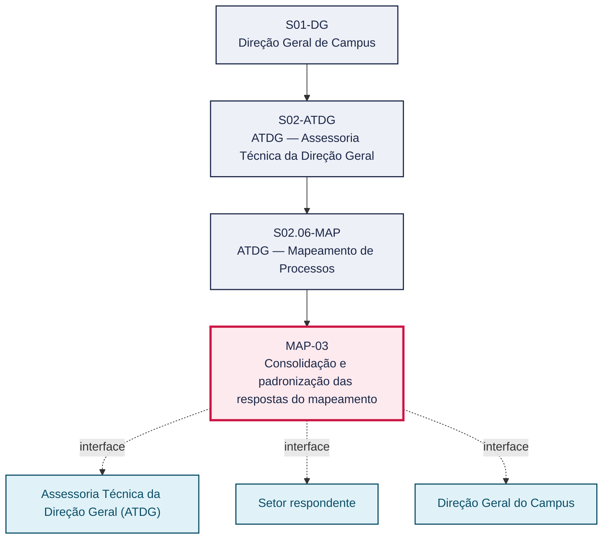
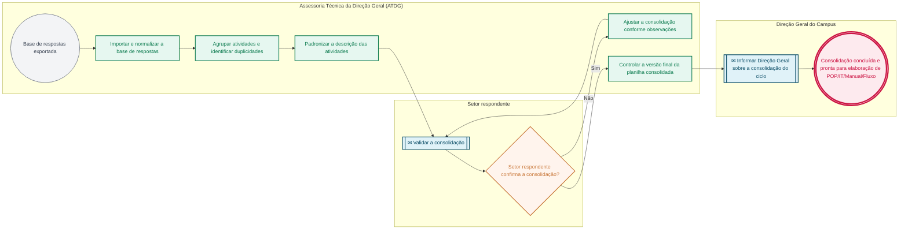

# POP MAP-03 — Consolidação e padronização das respostas do mapeamento

> **Documento vivo** · ATDG — Assessoria Técnica da Direção Geral · UNIOESTE Campus Foz do Iguaçu · Formato DDD híbrido + BPMN 2.0 padrão Anne Bail · Versão **1.0.0** · Status **em_validacao** · Atualizado em 2026-09-03

## 0. Cabeçalho DDD

| Divisão | Departamento | Descrição |
|---|---|---|
| ATDG — Assessoria Técnica da Direção Geral | ATDG — Mapeamento de Processos | Consolidação e padronização das respostas do mapeamento. Processo codificado no manual institucional da ATDG (jun/2026); conteúdo operacional a documentar. |

| Domínio | Subdomínio | Tipo | Contexto delimitado |
|---|---|---|---|
| Assessoria Técnica e Gestão por Processos | Consolidação e padronização das respostas do mapeamento | core | S02.06-MAP |

### 0.3 Linguagem ubíqua (glossário do processo)

| Termo | Definição | Sistema |
|---|---|---|
| Consolidação | Etapa de normalização, agrupamento e padronização das respostas do checklist em uma base única por função. | OneDrive ATDG |

## 1. Identificação

| Campo | Valor |
|---|---|
| Código | MAP-03 |
| Setor | ATDG — Assessoria Técnica da Direção Geral (`S02.06-MAP`) |
| Responsável (função) | Assessoria Técnica da Direção Geral (ATDG) |
| Periodicidade | Por ciclo do projeto de Mapeamento de Processos |
| Subordinação | ATDG — Assessoria Técnica da Direção Geral |
| Normativa | Lei nº 13.709/2018 (Lei Geral de Proteção de Dados Pessoais — LGPD) |
| Produto ATDG | POP |
| Pasta OneDrive | 03_MAPEAMENTO DE PROCESSOS |
| Fontes (entradas do Canvas) | pb-atdg, 1780963200015, 1780963200016, 1780963200017, 1780963200031 |
| Lacunas abertas | formulario, prazo, versao_documento |
| Agente responsável | pop-map-03 |

## 2. Organograma

## 3. Playbook

### 3.1 Gatilho (evento de domínio)

**Base de respostas do checklist exportada (MAP-02) para consolidação** — origem: Assessoria Técnica da Direção Geral (ATDG)

### 3.2 Entrada

- Base de respostas do checklist exportada (MAP-02)
- Relação de setores, cargos e funções (MAP-01)

### 3.3 Passo a passo

| Nº | Ação | Responsável | Sistema | Artefato | Prazo | Evento |
|---|---|---|---|---|---|---|
| 1 | Importar a base de respostas exportada do Microsoft Forms | Assessoria Técnica da Direção Geral (ATDG) | OneDrive ATDG | Base de respostas | A definir | Base importada |
| 2 | Normalizar os campos de setor, cargo e função das respostas | Assessoria Técnica da Direção Geral (ATDG) | OneDrive ATDG | Planilha em consolidação | A definir | Campos normalizados |
| 3 | Agrupar as atividades declaradas por função e identificar duplicidades | Assessoria Técnica da Direção Geral (ATDG) | OneDrive ATDG | Planilha em consolidação | A definir | Atividades agrupadas |
| 4 | Padronizar a descrição das atividades em linguagem de processo | Assessoria Técnica da Direção Geral (ATDG) | OneDrive ATDG | Planilha consolidada | A definir | Descrição padronizada |
| 5 | Validar a consolidação com o setor respondente | Setor respondente | OneDrive ATDG | Planilha consolidada | A definir | Consolidação validada |
| 6 | Controlar a versão final da planilha consolidada e arquivar as versões anteriores | Assessoria Técnica da Direção Geral (ATDG) | OneDrive ATDG | Planilha consolidada (versão final) | A definir | Versão final controlada |

### 3.4 Saída (entregáveis)

- Planilha consolidada e padronizada de processos por função
- Lista de atividades padronizadas por processo

## 4. Formulários e artefatos (agregados)

| Nome | Tipo | Sistema | Campos-chave | Preenchimento |
|---|---|---|---|---|
| Planilha consolidada de atividades por função | registro | OneDrive ATDG | setor, função, atividade padronizada, periodicidade | Assessoria Técnica da Direção Geral (ATDG) |
| Controle de versões da consolidação | registro | OneDrive ATDG | versão, data, responsável pela alteração, status (em elaboração/final) | Assessoria Técnica da Direção Geral (ATDG) |

## 5. Decisões, exceções e pontos de atenção

| Decisão | Condição | Sim → | Não → |
|---|---|---|---|
| O setor respondente confirma que a consolidação reflete corretamente as atividades declaradas? | Planilha consolidada e padronizada de atividades por função | Controlar a versão final e encaminhar para elaboração de POP/IT/Manual/Fluxo (MAP-04) | Ajustar a consolidação conforme as observações do setor respondente |

**Pontos de atenção**

- Existência de versões de teste e cópias de planilhas de consolidação — usar somente a versão final controlada
- Dados pessoais dos respondentes nas respostas originais — restringir acesso à planilha consolidada conforme a LGPD

## 6. Contingência

- Atividades divergentes entre respondentes da mesma função: consolidar com o setor respondente antes de padronizar
- Planilha de consolidação corrompida: recuperar a partir do controle de versões no OneDrive ATDG
- Setor não valida a consolidação no prazo: registrar a pendência e prosseguir com ressalva para revisão posterior

## 7. Checklist

- ( ) Base de respostas importada e normalizada
- ( ) Atividades agrupadas e duplicidades identificadas
- ( ) Descrição das atividades padronizada
- ( ) Consolidação validada pelo setor respondente
- ( ) Versão final controlada e versões anteriores arquivadas

## 8. KPI / Indicadores

| Indicador | Fórmula | Meta | Fonte |
|---|---|---|---|
| Percentual de funções com atividades consolidadas e padronizadas | (Funções consolidadas / total de funções respondentes) × 100 | A definir | OneDrive ATDG |
| Percentual de consolidações validadas pelo setor respondente sem retrabalho | (Consolidações aprovadas na 1ª validação / total de consolidações) × 100 | A definir | OneDrive ATDG |

## 9. Mapa de contexto (interfaces inter-setoriais)

| Origem | Relação | Destino | Artefato | Canal |
|---|---|---|---|---|
| Assessoria Técnica da Direção Geral (ATDG) | valida | Setor respondente | Planilha consolidada de atividades por função | OneDrive ATDG |
| Assessoria Técnica da Direção Geral (ATDG) | informa | Direção Geral do Campus | Relatório de consolidação do ciclo de mapeamento | OneDrive ATDG |

## 10. Fluxograma (BPMN 2.0 — padrão Anne Bail)

## 11. Especificação BPMN para o Miro

**Raias:** Assessoria Técnica da Direção Geral (ATDG) · Setor respondente · Direção Geral do Campus

| Id | Tipo | Elemento | Raia |
|---|---|---|---|
| e1 | inicio | Base de respostas exportada | Assessoria Técnica da Direção Geral (ATDG) |
| e2 | atividade | Importar e normalizar a base de respostas | Assessoria Técnica da Direção Geral (ATDG) |
| e3 | atividade | Agrupar atividades e identificar duplicidades | Assessoria Técnica da Direção Geral (ATDG) |
| e4 | atividade | Padronizar a descrição das atividades | Assessoria Técnica da Direção Geral (ATDG) |
| e5 | captura | Validar a consolidação | Setor respondente |
| e6 | decisao | Setor respondente confirma a consolidação? | Setor respondente |
| e7 | atividade | Ajustar a consolidação conforme observações | Assessoria Técnica da Direção Geral (ATDG) |
| e8 | atividade | Controlar a versão final da planilha consolidada | Assessoria Técnica da Direção Geral (ATDG) |
| e9 | captura | Informar Direção Geral sobre a consolidação do ciclo | Direção Geral do Campus |
| e10 | fim | Consolidação concluída e pronta para elaboração de POP/IT/Manual/Fluxo | Direção Geral do Campus |

| De | Para | Rótulo |
|---|---|---|
| e1 | e2 | — |
| e2 | e3 | — |
| e3 | e4 | — |
| e4 | e5 | — |
| e5 | e6 | — |
| e6 | e7 | Não |
| e7 | e5 | — |
| e6 | e8 | Sim |
| e8 | e9 | — |
| e9 | e10 | — |

_Especificação gerada a partir dos passos do POP; 1 raia(s). Revisar decisões e pausas antes de construir no Miro._

## 12. Histórico de versões

| Versão | Data | Autor | Tipo | Mudanças | Fontes |
|---|---|---|---|---|---|
| 0.1.0 | 2026-09-02 | scripts/scaffold_pops.py | patch | Esqueleto inicial gerado deterministicamente | — |
| 1.0.0 | 2026-09-03 | agente:construtor-pop (lote B) | major | Passo adicionado após 0: Importar a base de respostas exportada do Microsoft Forms; Passo adicionado após 1: Normalizar os campos de setor, cargo e função das respostas; Passo adicionado após 2: Agrupar as atividades declaradas por função e identificar duplicidades; Passo adicionado após 3: Padronizar a descrição das atividades em linguagem de processo; Passo adicionado após 4: Validar a consolidação com o setor respondente; Passo adicionado após 5: Controlar a versão final da planilha consolidada e arquivar as versões anteriore; entrada_nova: +2; saida_nova: +2; artefatos_novos: +2; decisoes_novas: +1; kpis_novos: +2; mapa_contexto_novo: +2; pontos_atencao_novos: +2; contingencia_nova: +3; checklist_novo: +5; glossario_novo: +1; normativa_nova: +1; Campo identificacao.responsavel atualizado; Campo identificacao.periodicidade atualizado; Campo playbook.gatilho atualizado; Raias adicionadas: Assessoria Técnica da Direção Geral (ATDG), Setor respondente, Direção Geral do Campus; Elementos BPMN removidos: e1, e2; Elementos BPMN adicionados: 10; Status promovido a em_validacao (≥ 3 passos e responsável definido) | pb-atdg, 1780963200015, 1780963200016, 1780963200017, 1780963200031 |

## 13. Validação e aprovação

| Papel | Função / unidade | Data |
|---|---|---|
| Elaboração | ATDG — Assessoria Técnica da Direção Geral | 2026-09-02 |
| Revisão | A definir (responsável do setor) | ___/___/______ |
| Aprovação | Direção Geral do Campus | ___/___/______ |

## 14. Lições incorporadas

- **L-001** — Referir sempre função/cargo; nomes apenas no bloco 13 (Validação), com anuência (LGPD).
- **L-004** — Nunca regenerar POP existente: aplicar patch com changelog, fontes e versão.
- **L-006** — Preservar códigos legados como códigos de processo; não renumerar.
- **L-007** — Referência Externa é benchmark; normativa do POP só cita atos da Unioeste, do Estado do Paraná ou federais aplicáveis.
- **L-002** — Um passo = uma ação; ações compostas viram passos distintos.
- **L-003** — Cada linha do mapa de contexto gera um elemento `captura` no BPMN e um passo na raia de destino.

---
_Canvas Vivo — Base de Conhecimento Institucional · ATDG · UNIOESTE Campus Foz do Iguaçu · gerado por `scripts/render_pop.py` a partir de `pops/MAP/MAP-03.pop.json` (diretrizes v1.8)._
