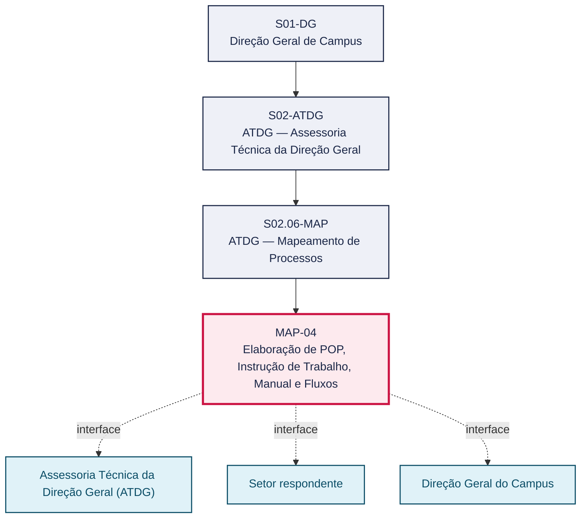
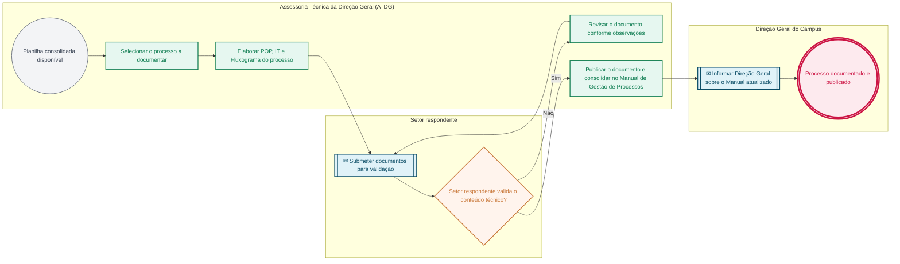

# POP MAP-04 — Elaboração de POP, Instrução de Trabalho, Manual e Fluxos

> **Documento vivo** · ATDG — Assessoria Técnica da Direção Geral · UNIOESTE Campus Foz do Iguaçu · Formato DDD híbrido + BPMN 2.0 padrão Anne Bail · Versão **1.0.0** · Status **em_validacao** · Atualizado em 2026-09-03

## 0. Cabeçalho DDD

| Divisão | Departamento | Descrição |
|---|---|---|
| ATDG — Assessoria Técnica da Direção Geral | ATDG — Mapeamento de Processos | Elaboração de POP, Instrução de Trabalho, Manual e Fluxos. Processo codificado no manual institucional da ATDG (jun/2026); conteúdo operacional a documentar. |

| Domínio | Subdomínio | Tipo | Contexto delimitado |
|---|---|---|---|
| Assessoria Técnica e Gestão por Processos | Elaboração de POP, Instrução de Trabalho, Manual e Fluxos | core | S02.06-MAP |

### 0.3 Linguagem ubíqua (glossário do processo)

| Termo | Definição | Sistema |
|---|---|---|
| Instrução de Trabalho (IT) | Documento complementar ao POP que detalha o passo a passo operacional de uma atividade específica. | OneDrive ATDG |
| Manual de Gestão de Processos | Documento consolidado que reúne os POPs, ITs e fluxos de todos os processos mapeados do Campus. | OneDrive ATDG |

## 1. Identificação

| Campo | Valor |
|---|---|
| Código | MAP-04 |
| Setor | ATDG — Assessoria Técnica da Direção Geral (`S02.06-MAP`) |
| Responsável (função) | Assessoria Técnica da Direção Geral (ATDG) |
| Periodicidade | Contínuo, por processo consolidado no ciclo de mapeamento |
| Subordinação | ATDG — Assessoria Técnica da Direção Geral |
| Normativa | Plano Diretor Unioeste 2017-2026 |
| Produto ATDG | POP |
| Pasta OneDrive | 03_MAPEAMENTO DE PROCESSOS |
| Fontes (entradas do Canvas) | pb-atdg, 1780963200034, 1780963200035, 1780963200031 |
| Lacunas abertas | formulario, prazo |
| Agente responsável | pop-map-04 |

## 2. Organograma

## 3. Playbook

### 3.1 Gatilho (evento de domínio)

**Planilha consolidada e padronizada de atividades por função disponível (MAP-03)** — origem: Assessoria Técnica da Direção Geral (ATDG)

### 3.2 Entrada

- Planilha consolidada de atividades por função (MAP-03)
- Modelo/template de POP, IT, Manual e Fluxo

### 3.3 Passo a passo

| Nº | Ação | Responsável | Sistema | Artefato | Prazo | Evento |
|---|---|---|---|---|---|---|
| 1 | Selecionar o processo a documentar a partir da planilha consolidada | Assessoria Técnica da Direção Geral (ATDG) | OneDrive ATDG | Planilha consolidada | A definir | Processo selecionado |
| 2 | Elaborar o Procedimento Operacional Padrão (POP) do processo | Assessoria Técnica da Direção Geral (ATDG) | OneDrive ATDG | POP | A definir | POP elaborado |
| 3 | Elaborar a Instrução de Trabalho (IT), quando aplicável | Assessoria Técnica da Direção Geral (ATDG) | OneDrive ATDG | Instrução de Trabalho | A definir | IT elaborada |
| 4 | Elaborar o fluxograma do processo (BPMN) | Assessoria Técnica da Direção Geral (ATDG) | OneDrive ATDG | Fluxograma do processo | A definir | Fluxograma elaborado |
| 5 | Submeter POP, IT e Fluxo ao setor respondente para validação de conteúdo | Assessoria Técnica da Direção Geral (ATDG) | OneDrive ATDG | POP/IT/Fluxo | A definir | Documentos submetidos |
| 6 | Validar o conteúdo técnico do processo documentado | Setor respondente | OneDrive ATDG | POP/IT/Fluxo validado | A definir | Conteúdo validado |
| 7 | Publicar o POP/IT/Fluxo e consolidar no Manual de Gestão de Processos do Campus | Assessoria Técnica da Direção Geral (ATDG) | OneDrive ATDG | Manual de Gestão de Processos | A definir | Documento publicado e manual atualizado |

### 3.4 Saída (entregáveis)

- POP, Instrução de Trabalho, Manual e Fluxo do processo publicados
- Manual de Gestão de Processos do Campus atualizado

## 4. Formulários e artefatos (agregados)

| Nome | Tipo | Sistema | Campos-chave | Preenchimento |
|---|---|---|---|---|
| Procedimento Operacional Padrão (POP) | documento | OneDrive ATDG | identificação, playbook, artefatos, fluxograma, versão | Assessoria Técnica da Direção Geral (ATDG) |
| Manual de Gestão de Processos do Campus | documento | OneDrive ATDG | setor, processos documentados, versão | Assessoria Técnica da Direção Geral (ATDG) |

## 5. Decisões, exceções e pontos de atenção

| Decisão | Condição | Sim → | Não → |
|---|---|---|---|
| O setor respondente valida o conteúdo técnico do POP/IT/Fluxo elaborado? | POP, Instrução de Trabalho e Fluxo elaborados pela ATDG a partir da planilha consolidada | Publicar o documento e consolidá-lo no Manual de Gestão de Processos | Revisar o documento conforme as observações do setor respondente |

**Pontos de atenção**

- Manter numeração/codificação de processos legados sem renumerar
- Controlar versionamento dos documentos publicados, evitando cópias e versões de teste em circulação

## 6. Contingência

- Processo documentado diverge da prática real do setor: retornar ao setor respondente para nova validação antes de publicar
- Template de POP/IT desatualizado: atualizar a partir do modelo vigente antes de nova elaboração
- Documento publicado precisa de correção pontual: aplicar patch incremental sem regenerar o POP

## 7. Checklist

- ( ) Processo selecionado a partir da planilha consolidada
- ( ) POP elaborado com playbook, artefatos e fluxograma
- ( ) Instrução de Trabalho elaborada quando aplicável
- ( ) Conteúdo validado pelo setor respondente
- ( ) Documento publicado e Manual de Gestão de Processos atualizado

## 8. KPI / Indicadores

| Indicador | Fórmula | Meta | Fonte |
|---|---|---|---|
| Percentual de processos consolidados com POP publicado | (Processos com POP publicado / total de processos consolidados) × 100 | A definir | OneDrive ATDG |
| Percentual de POPs validados pelo setor respondente na primeira submissão | (POPs aprovados na 1ª submissão / total de POPs submetidos) × 100 | A definir | OneDrive ATDG |

## 9. Mapa de contexto (interfaces inter-setoriais)

| Origem | Relação | Destino | Artefato | Canal |
|---|---|---|---|---|
| Assessoria Técnica da Direção Geral (ATDG) | valida | Setor respondente | POP/IT/Fluxo elaborado | OneDrive ATDG |
| Assessoria Técnica da Direção Geral (ATDG) | informa | Direção Geral do Campus | Manual de Gestão de Processos atualizado | OneDrive ATDG |

## 10. Fluxograma (BPMN 2.0 — padrão Anne Bail)

## 11. Especificação BPMN para o Miro

**Raias:** Assessoria Técnica da Direção Geral (ATDG) · Setor respondente · Direção Geral do Campus

| Id | Tipo | Elemento | Raia |
|---|---|---|---|
| e1 | inicio | Planilha consolidada disponível | Assessoria Técnica da Direção Geral (ATDG) |
| e2 | atividade | Selecionar o processo a documentar | Assessoria Técnica da Direção Geral (ATDG) |
| e3 | atividade | Elaborar POP, IT e Fluxograma do processo | Assessoria Técnica da Direção Geral (ATDG) |
| e4 | captura | Submeter documentos para validação | Setor respondente |
| e5 | decisao | Setor respondente valida o conteúdo técnico? | Setor respondente |
| e6 | atividade | Revisar o documento conforme observações | Assessoria Técnica da Direção Geral (ATDG) |
| e7 | atividade | Publicar o documento e consolidar no Manual de Gestão de Processos | Assessoria Técnica da Direção Geral (ATDG) |
| e8 | captura | Informar Direção Geral sobre o Manual atualizado | Direção Geral do Campus |
| e9 | fim | Processo documentado e publicado | Direção Geral do Campus |

| De | Para | Rótulo |
|---|---|---|
| e1 | e2 | — |
| e2 | e3 | — |
| e3 | e4 | — |
| e4 | e5 | — |
| e5 | e6 | Não |
| e6 | e4 | — |
| e5 | e7 | Sim |
| e7 | e8 | — |
| e8 | e9 | — |

_Especificação gerada a partir dos passos do POP; 1 raia(s). Revisar decisões e pausas antes de construir no Miro._

## 12. Histórico de versões

| Versão | Data | Autor | Tipo | Mudanças | Fontes |
|---|---|---|---|---|---|
| 0.1.0 | 2026-09-02 | scripts/scaffold_pops.py | patch | Esqueleto inicial gerado deterministicamente | — |
| 1.0.0 | 2026-09-03 | agente:construtor-pop (lote B) | major | Passo adicionado após 0: Selecionar o processo a documentar a partir da planilha consolidada; Passo adicionado após 1: Elaborar o Procedimento Operacional Padrão (POP) do processo; Passo adicionado após 2: Elaborar a Instrução de Trabalho (IT), quando aplicável; Passo adicionado após 3: Elaborar o fluxograma do processo (BPMN); Passo adicionado após 4: Submeter POP, IT e Fluxo ao setor respondente para validação de conteúdo; Passo adicionado após 5: Validar o conteúdo técnico do processo documentado; Passo adicionado após 6: Publicar o POP/IT/Fluxo e consolidar no Manual de Gestão de Processos do Campus; entrada_nova: +2; saida_nova: +2; artefatos_novos: +2; decisoes_novas: +1; kpis_novos: +2; mapa_contexto_novo: +2; pontos_atencao_novos: +2; contingencia_nova: +3; checklist_novo: +5; glossario_novo: +2; normativa_nova: +1; Campo identificacao.responsavel atualizado; Campo identificacao.periodicidade atualizado; Campo playbook.gatilho atualizado; Raias adicionadas: Assessoria Técnica da Direção Geral (ATDG), Setor respondente, Direção Geral do Campus; Elementos BPMN removidos: e1, e2; Elementos BPMN adicionados: 9; Status promovido a em_validacao (≥ 3 passos e responsável definido) | pb-atdg, 1780963200034, 1780963200035, 1780963200031 |

## 13. Validação e aprovação

| Papel | Função / unidade | Data |
|---|---|---|
| Elaboração | ATDG — Assessoria Técnica da Direção Geral | 2026-09-02 |
| Revisão | A definir (responsável do setor) | ___/___/______ |
| Aprovação | Direção Geral do Campus | ___/___/______ |

## 14. Lições incorporadas

- **L-001** — Referir sempre função/cargo; nomes apenas no bloco 13 (Validação), com anuência (LGPD).
- **L-004** — Nunca regenerar POP existente: aplicar patch com changelog, fontes e versão.
- **L-006** — Preservar códigos legados como códigos de processo; não renumerar.
- **L-007** — Referência Externa é benchmark; normativa do POP só cita atos da Unioeste, do Estado do Paraná ou federais aplicáveis.
- **L-002** — Um passo = uma ação; ações compostas viram passos distintos.
- **L-003** — Cada linha do mapa de contexto gera um elemento `captura` no BPMN e um passo na raia de destino.

---
_Canvas Vivo — Base de Conhecimento Institucional · ATDG · UNIOESTE Campus Foz do Iguaçu · gerado por `scripts/render_pop.py` a partir de `pops/MAP/MAP-04.pop.json` (diretrizes v1.8)._
