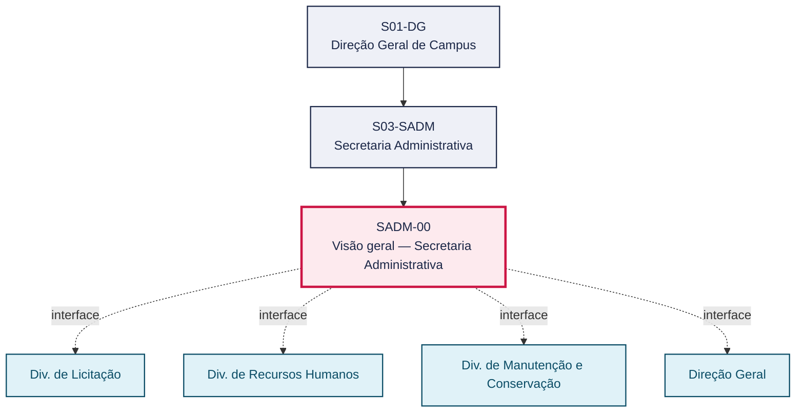

# POP SADM-00 — Visão geral — Secretaria Administrativa

> **Documento vivo** · ATDG — Assessoria Técnica da Direção Geral · UNIOESTE Campus Foz do Iguaçu · Formato DDD híbrido + BPMN 2.0 padrão Anne Bail · Versão **1.0.0** · Status **em_validacao** · Atualizado em 2026-09-03

## 0. Cabeçalho DDD

| Divisão | Departamento | Descrição |
|---|---|---|
| Secretaria Administrativa | Secretaria Administrativa | Coordena as divisões administrativas do Campus, recebendo, triando e encaminhando demandas administrativas via e-Protocolo à divisão responsável (Almoxarifado, Compras, Licitação, Recursos Humanos, Manutenção e Conservação e demais em construção), acompanhando o atendimento até a conclusão e escalando à Direção Geral quando necessário. |

| Domínio | Subdomínio | Tipo | Contexto delimitado |
|---|---|---|---|
| Administração e Suprimentos | Coordenação e triagem de demandas administrativas via e-Protocolo | suporte | S03-SADM |

### 0.3 Linguagem ubíqua (glossário do processo)

| Termo | Definição | Sistema |
|---|---|---|
| Coordenação Administrativa | Estrutura da Secretaria Administrativa responsável por coordenar as divisões administrativas do Campus, conforme o organograma do Campus Foz. | — |

## 1. Identificação

| Campo | Valor |
|---|---|
| Código | SADM-00 |
| Setor | Sec. Administrativa — Geral (`S03-SADM`) |
| Responsável (função) | Coordenador(a) Administrativo(a) |
| Periodicidade | Contínua, por demanda |
| Subordinação | Direção Geral de Campus |
| Normativa | Estrutura conforme organograma do Campus Foz (Coordenação Administrativa) |
| Produto ATDG | POP |
| Pasta OneDrive | 03_MAPEAMENTO DE PROCESSOS |
| Fontes (entradas do Canvas) | pb-sec-administrativa |
| Lacunas abertas | prazo |
| Agente responsável | pop-sadm-00 |

## 2. Organograma

## 3. Playbook

### 3.1 Gatilho (evento de domínio)

**Recebimento de demanda administrativa própria ou de outro setor do campus** — origem: Servidor / Setor solicitante

### 3.2 Entrada

- Demanda administrativa registrada no e-Protocolo

### 3.3 Passo a passo

| Nº | Ação | Responsável | Sistema | Artefato | Prazo | Evento |
|---|---|---|---|---|---|---|
| 1 | Receber a demanda administrativa (própria ou de outro setor) via e-Protocolo | Coordenador(a) Administrativo(a) | e-Protocolo | Demanda administrativa (e-Protocolo) | A definir | Demanda recebida |
| 2 | Identificar a divisão responsável pelo atendimento da demanda | Coordenador(a) Administrativo(a) | e-Protocolo | Demanda administrativa (e-Protocolo) | A definir | Divisão responsável identificada |
| 3 | Consultar o playbook ou POP específico da divisão responsável | Coordenador(a) Administrativo(a) | e-Protocolo | Demanda administrativa (e-Protocolo) | A definir | Playbook/POP consultado |
| 4 | Encaminhar a demanda à divisão responsável via e-Protocolo | Coordenador(a) Administrativo(a) | e-Protocolo | Demanda administrativa (e-Protocolo) | A definir | Demanda encaminhada |
| 5 | Acompanhar o andamento da demanda até a conclusão | Coordenador(a) Administrativo(a) | e-Protocolo | Demanda administrativa (e-Protocolo) | A definir | Andamento acompanhado |
| 6 | Escalar à Direção Geral as demandas não resolvidas no prazo ou que exijam decisão superior | Coordenador(a) Administrativo(a) | e-Protocolo | Demanda administrativa (e-Protocolo) | A definir | Demanda escalada |
| 7 | Consolidar o status das demandas das divisões administrativas | Coordenador(a) Administrativo(a) | e-Protocolo | Consolidado de status das demandas | A definir | Status consolidado |
| 8 | Informar o resultado ao setor ou servidor solicitante | Coordenador(a) Administrativo(a) | e-Protocolo | Demanda administrativa (e-Protocolo) | A definir | Solicitante informado |

### 3.4 Saída (entregáveis)

- Demanda atendida pela divisão responsável e resultado informado ao solicitante

## 4. Formulários e artefatos (agregados)

| Nome | Tipo | Sistema | Campos-chave | Preenchimento |
|---|---|---|---|---|
| Demanda administrativa (e-Protocolo) | registro | e-Protocolo | setor solicitante, divisão responsável, status | Coordenador(a) Administrativo(a) |
| Consolidado de status das demandas | registro | e-Protocolo | período, divisão, quantidade de demandas, status | Coordenador(a) Administrativo(a) |

## 5. Decisões, exceções e pontos de atenção

| Decisão | Condição | Sim → | Não → |
|---|---|---|---|
| A demanda foi resolvida pela divisão responsável dentro do prazo? | Acompanhamento do andamento da demanda encaminhada | Informar o resultado ao solicitante | Escalar a demanda à Direção Geral |

**Pontos de atenção**

- Divisões de Segurança e Transportes, Informática, Patrimônio, Apoio Técnico aos Laboratórios e Serviços de Apoio ainda em construção
- A triagem correta da divisão responsável evita retrabalho e atraso no atendimento da demanda

## 6. Contingência

- Se a divisão responsável não for identificada com clareza, consultar o organograma canônico ou a Direção Geral antes de encaminhar
- Se a demanda não for resolvida no prazo esperado, escalar à Direção Geral com o histórico do andamento
- Se a demanda envolver mais de uma divisão, coordenar o atendimento conjunto e designar um responsável principal

## 7. Checklist

- ( ) Demanda registrada no e-Protocolo
- ( ) Divisão responsável identificada corretamente
- ( ) Playbook/POP da divisão consultado antes do encaminhamento
- ( ) Andamento da demanda acompanhado até a conclusão
- ( ) Resultado informado ao solicitante

## 8. KPI / Indicadores

| Indicador | Fórmula | Meta | Fonte |
|---|---|---|---|
| Prazo médio de encaminhamento da demanda à divisão responsável | Data de encaminhamento − Data de recebimento | A definir | e-Protocolo |
| Percentual de demandas concluídas sem necessidade de escalonamento à Direção Geral | (Demandas concluídas sem escalonamento ÷ total de demandas) × 100 | A definir | e-Protocolo |

## 9. Mapa de contexto (interfaces inter-setoriais)

| Origem | Relação | Destino | Artefato | Canal |
|---|---|---|---|---|
| Sec. Administrativa — Geral | fornece | Div. de Licitação | Demanda administrativa encaminhada | e-Protocolo |
| Sec. Administrativa — Geral | fornece | Div. de Recursos Humanos | Demanda administrativa encaminhada | e-Protocolo |
| Sec. Administrativa — Geral | fornece | Div. de Manutenção e Conservação | Demanda administrativa encaminhada | e-Protocolo |
| Sec. Administrativa — Geral | informa | Direção Geral | Demandas escaladas e status consolidado | e-Protocolo |

## 10. Fluxograma (BPMN 2.0 — padrão Anne Bail)

```mermaid
flowchart LR
  subgraph R1["Coordenador(a) Administrativo(a)"]
    direction LR
    e1(("Recebimento de demanda administrativa própria ou de outro setor do ca…"))
    e2["Receber a demanda administrativa (própria ou de outro setor) via e-Pr…"]
    e3["Identificar a divisão responsável pelo atendimento da demanda"]
    e4["Consultar o playbook ou POP específico da divisão responsável"]
    e5["Encaminhar a demanda à divisão responsável via e-Protocolo"]
    e6["Acompanhar o andamento da demanda até a conclusão"]
    e7["Escalar à Direção Geral as demandas não resolvidas no prazo ou que ex…"]
    e8["Consolidar o status das demandas das divisões administrativas"]
    e9["Informar o resultado ao setor ou servidor solicitante"]
    e14((("Demanda atendida pela divisão responsável e resultado informado ao so…")))
  end
  subgraph R2["Div. de Licitação"]
    direction LR
    e10[["✉ Encaminhar a Div. de Licitação"]]
  end
  subgraph R3["Div. de Recursos Humanos"]
    direction LR
    e11[["✉ Encaminhar a Div. de Recursos Humanos"]]
  end
  subgraph R4["Div. de Manutenção e Conservação"]
    direction LR
    e12[["✉ Encaminhar a Div. de Manutenção e Conservação"]]
  end
  subgraph R5["Direção Geral"]
    direction LR
    e13[["✉ Informar Direção Geral"]]
  end
  e1 --> e2
  e2 --> e3
  e3 --> e4
  e4 --> e5
  e5 --> e6
  e6 --> e7
  e7 --> e8
  e8 --> e9
  e9 --> e10
  e10 --> e11
  e11 --> e12
  e12 --> e13
  e13 --> e14
  classDef inicio fill:#f3f4f6,stroke:#6b7280,stroke-width:1.5px,color:#374151
  classDef atividade fill:#E6F7F0,stroke:#0B7A4E,stroke-width:2px,color:#0B7A4E
  classDef decisao fill:#FFF4ED,stroke:#C9783A,stroke-width:2px,color:#C9783A
  classDef fim fill:#FDEAEE,stroke:#CC1544,stroke-width:4px,color:#CC1544
  classDef pausa fill:#FDEAEE,stroke:#CC1544,stroke-width:2px,color:#CC1544
  classDef captura fill:#E0F2F8,stroke:#0B4D66,stroke-width:2px,color:#0B4D66
  class e1 inicio
  class e2,e3,e4,e5,e6,e7,e8,e9 atividade
  class e10,e11,e12,e13 captura
  class e14 fim
```

## 11. Especificação BPMN para o Miro

**Raias:** Coordenador(a) Administrativo(a) · Div. de Licitação · Div. de Recursos Humanos · Div. de Manutenção e Conservação · Direção Geral

| Id | Tipo | Elemento | Raia |
|---|---|---|---|
| e1 | inicio | Recebimento de demanda administrativa própria ou de outro setor do campus | Coordenador(a) Administrativo(a) |
| e2 | atividade | Receber a demanda administrativa (própria ou de outro setor) via e-Protocolo | Coordenador(a) Administrativo(a) |
| e3 | atividade | Identificar a divisão responsável pelo atendimento da demanda | Coordenador(a) Administrativo(a) |
| e4 | atividade | Consultar o playbook ou POP específico da divisão responsável | Coordenador(a) Administrativo(a) |
| e5 | atividade | Encaminhar a demanda à divisão responsável via e-Protocolo | Coordenador(a) Administrativo(a) |
| e6 | atividade | Acompanhar o andamento da demanda até a conclusão | Coordenador(a) Administrativo(a) |
| e7 | atividade | Escalar à Direção Geral as demandas não resolvidas no prazo ou que exijam decisão superior | Coordenador(a) Administrativo(a) |
| e8 | atividade | Consolidar o status das demandas das divisões administrativas | Coordenador(a) Administrativo(a) |
| e9 | atividade | Informar o resultado ao setor ou servidor solicitante | Coordenador(a) Administrativo(a) |
| e10 | captura | Encaminhar a Div. de Licitação | Div. de Licitação |
| e11 | captura | Encaminhar a Div. de Recursos Humanos | Div. de Recursos Humanos |
| e12 | captura | Encaminhar a Div. de Manutenção e Conservação | Div. de Manutenção e Conservação |
| e13 | captura | Informar Direção Geral | Direção Geral |
| e14 | fim | Demanda atendida pela divisão responsável e resultado informado ao solicitante | Coordenador(a) Administrativo(a) |

| De | Para | Rótulo |
|---|---|---|
| e1 | e2 | — |
| e2 | e3 | — |
| e3 | e4 | — |
| e4 | e5 | — |
| e5 | e6 | — |
| e6 | e7 | — |
| e7 | e8 | — |
| e8 | e9 | — |
| e9 | e10 | — |
| e10 | e11 | — |
| e11 | e12 | — |
| e12 | e13 | — |
| e13 | e14 | — |

_Especificação gerada a partir dos passos do POP; 5 raia(s). Revisar decisões e pausas antes de construir no Miro._

## 12. Histórico de versões

| Versão | Data | Autor | Tipo | Mudanças | Fontes |
|---|---|---|---|---|---|
| 0.1.0 | 2026-09-02 | scripts/scaffold_pops.py | patch | Esqueleto inicial gerado deterministicamente a partir das entradas pb-sec-administrativa | pb-sec-administrativa |
| 1.0.0 | 2026-09-03 | agente:construtor-pop (lote C) | major | Passo 1 alterado (acao, responsavel, sistema, artefato, prazo, evento, fontes); Passo 2 alterado (acao, responsavel, sistema, artefato, prazo, evento, fontes); Passo 3 alterado (acao, responsavel, sistema, artefato, prazo, evento, fontes); Passo adicionado após 2: Consultar o playbook ou POP específico da divisão responsável; Passo adicionado após 3: Acompanhar o andamento da demanda até a conclusão; Passo adicionado após 3: Escalar à Direção Geral as demandas não resolvidas no prazo ou que exijam decisã; Passo adicionado após 3: Consolidar o status das demandas das divisões administrativas; Passo adicionado após 3: Informar o resultado ao setor ou servidor solicitante; entrada_nova: +1; saida_nova: +1; artefatos_novos: +2; decisoes_novas: +1; kpis_novos: +2; mapa_contexto_novo: +4; pontos_atencao_novos: +1; contingencia_nova: +3; checklist_novo: +5; glossario_novo: +1; Campo identificacao.responsavel atualizado; Campo identificacao.periodicidade atualizado; Campo ddd.descricao atualizado; Campo ddd.subdominio atualizado; Campo playbook.gatilho atualizado; Fluxograma regenerado a partir dos passos; Status promovido a em_validacao (≥ 3 passos e responsável definido) | pb-sec-administrativa |

## 13. Validação e aprovação

| Papel | Função / unidade | Data |
|---|---|---|
| Elaboração | ATDG — Assessoria Técnica da Direção Geral | 2026-09-02 |
| Revisão | A definir (responsável do setor) | ___/___/______ |
| Aprovação | Direção Geral do Campus | ___/___/______ |

## 14. Lições incorporadas

- **L-001** — Referir sempre função/cargo; nomes apenas no bloco 13 (Validação), com anuência (LGPD).
- **L-004** — Nunca regenerar POP existente: aplicar patch com changelog, fontes e versão.
- **L-006** — Preservar códigos legados como códigos de processo; não renumerar.
- **L-007** — Referência Externa é benchmark; normativa do POP só cita atos da Unioeste, do Estado do Paraná ou federais aplicáveis.
- **L-002** — Um passo = uma ação; ações compostas viram passos distintos.
- **L-003** — Cada linha do mapa de contexto gera um elemento `captura` no BPMN e um passo na raia de destino.
- **L-005** — No diagnóstico, agrupar versões do mesmo documento e registrar lacuna `versao_documento`.

---
_Canvas Vivo — Base de Conhecimento Institucional · ATDG · UNIOESTE Campus Foz do Iguaçu · gerado por `scripts/render_pop.py` a partir de `pops/SADM/SADM-00.pop.json` (diretrizes v1.8)._
